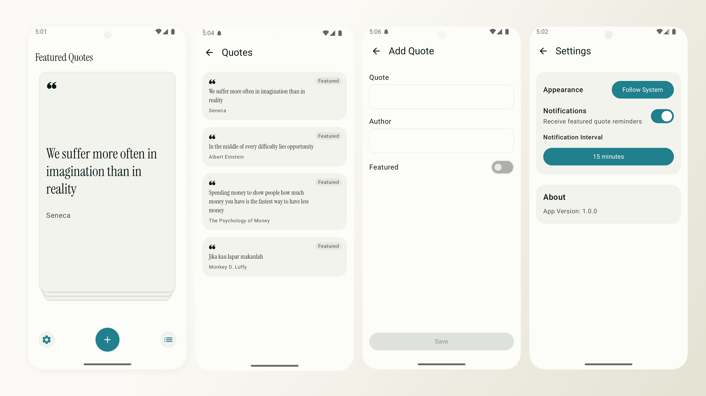

# Zest

A minimalistic quotes app built entirely with Kotlin and Jetpack Compose, demonstrating modern Android development practices inspired by the [Now in Android](https://github.com/android/nowinandroid) app architecture.



## Overview

Zest is a fully functional Android application that showcases clean architecture principles, modular design, and modern Android development best practices. The app provides a beautiful, minimalist interface for managing and browsing inspirational quotes.

## Features

Zest includes the following features:

- **Quote Management**: Create, edit, delete, and organize quotes
- **Featured Quotes**: Mark quotes as featured and browse them in a swipeable card interface
- **User Preferences**:
  - Dark theme support (Follow System, Light, Dark)
  - Notification settings with customizable intervals
- **Modern UI**: Minimalist design inspired by Perplexity.ai with Material 3 components
- **Offline-first**: All data stored locally using Room database

## Architecture

Zest follows the [official architecture guidance](https://developer.android.com/topic/architecture) and implements a multi-layered architecture with clear separation of concerns.

### Architecture Patterns

#### MVVM (Model-View-ViewModel)

The app uses the MVVM pattern with a custom `BaseViewModel<STATE>` class that provides type-safe state management using Kotlin StateFlow:

```
+-------------------------------------+
|   UI Layer (Composables)            |
|   - Screens & Components            |
|   - User Interactions               |
+--------------+----------------------+
               | Events ^
               | State  v
+--------------v----------------------+
|   ViewModel Layer                   |
|   - BaseViewModel<STATE>            |
|   - StateFlow<STATE>                |
|   - Business Logic                  |
+--------------+----------------------+
               |
               | Data Requests
               | Flow<Result>
+--------------v----------------------+
|   Repository Layer                  |
|   - QuoteRepository                 |
|   - UserDataRepository              |
|   - Either<T> Error Handling        |
+--------------+----------------------+
               |
               | CRUD Operations
               | Flow<Entity>
+--------------v----------------------+
|   Data Sources                      |
|   - Room Database (QuotesDao)       |
|   - DataStore (Preferences)         |
+-------------------------------------+
```

Each screen has its own ViewModel and State class, ensuring predictable state management and easy testing.

#### Repository Pattern

Data access is abstracted through repository interfaces (`QuoteRepository`, `UserDataRepository`), with concrete implementations handling the interaction with local data sources. This pattern provides:

- Abstraction from data source implementation details
- Centralized data access logic
- Easy testing with mock repositories
- Future-proof design for adding remote data sources

#### Unidirectional Data Flow (UDF)

Following UDF principles:

- **State flows down**: ViewModels expose immutable state via StateFlow
- **Events flow up**: UI sends events to ViewModels through event handlers
- **Single source of truth**: ViewModels hold the single source of truth for UI state

#### Either/Result Pattern

Custom `Either<T>` sealed class for type-safe error handling:

```kotlin
sealed class Either<out T> {
    data class Success<out T>(val data: T) : Either<T>()
    data class Error(val message: String) : Either<Nothing>()
}
```

This pattern enables chainable operations with `.onSuccess()` and `.onFailure()` callbacks.

#### Dependency Injection

Hilt provides compile-time dependency injection throughout the app:

- `@HiltAndroidApp` on application class
- `@HiltViewModel` for ViewModels
- Assisted injection for ViewModels with runtime parameters
- Module-scoped singletons for repositories and data sources

## Modularization

Zest follows a modular architecture to improve build times, enforce separation of concerns, and enable feature isolation.

### Module Structure

```
Zest/
|-- app/                          # Application module
|   |-- UI layer, navigation, screens
|
|-- core/
|   |-- common/                   # Common utilities and dispatchers
|   |-- data/                     # Repository implementations
|   |-- database/                 # Room database, entities, DAOs
|   |-- datastore/                # DataStore preferences
|   |-- datastore-proto/          # Protocol buffer definitions
|   |-- model/                    # Domain models
|
|-- build-logic/                  # Custom Gradle convention plugins
    |-- convention/
```

### Module Descriptions

| Module                 | Description                                                                      | Dependencies                                       |
| ---------------------- | -------------------------------------------------------------------------------- | -------------------------------------------------- |
| `app`                  | Main application module containing UI layer, screens, navigation, and ViewModels | All core modules                                   |
| `core:common`          | Common utilities, coroutine dispatchers, and shared code                         | None                                               |
| `core:model`           | Domain models and data classes (e.g., `Quote`)                                   | None                                               |
| `core:data`            | Repository interfaces and implementations                                        | `:core:model`, `:core:database`, `:core:datastore` |
| `core:database`        | Room database setup, entities, and DAOs                                          | `:core:model`                                      |
| `core:datastore`       | DataStore implementation for user preferences                                    | `:core:datastore-proto`                            |
| `core:datastore-proto` | Protocol buffer definitions for typed preferences                                | None                                               |
| `build-logic`          | Custom Gradle convention plugins                                                 | None                                               |

## Tech Stack

### UI

- **Jetpack Compose**: Modern declarative UI framework
- **Material 3**: Latest Material Design components and theming
- **Navigation Compose**: Type-safe navigation between screens
- **Custom Fonts**: Instrument Serif for elegant typography

### Dependency Injection

- **Hilt**: Compile-time dependency injection built on Dagger
- **Assisted Inject**: Factory pattern for ViewModels with runtime parameters

### Data & Persistence

- **Room**: SQLite database with compile-time SQL query validation
- **DataStore**: Type-safe preferences storage with Protocol Buffers
- **Kotlin Flow**: Reactive data streams for observing database changes

### Asynchronous Programming

- **Kotlin Coroutines**: Structured concurrency for async operations
- **StateFlow**: Hot flow for UI state management
- **Custom Dispatchers**: IO, Default, and Main dispatchers for different workloads

### Background Tasks

- **WorkManager**: Deferrable, guaranteed background work for notifications
- **Hilt Worker**: Dependency injection for WorkManager workers

### Build System

- **Gradle Kotlin DSL**: Type-safe build configuration
- **KSP (Kotlin Symbol Processing)**: Fast annotation processing for Room and Hilt
- **Version Catalogs**: Centralized dependency management
- **Custom Convention Plugins**: Consistent build configuration across modules

### Prerequisites

- **JDK 17 or higher** (enforced by the project)
- **Android Studio Ladybug | 2024.2.1** or newer
- **Android SDK** with API level 35

## Project Structure

The project follows a package-by-feature structure:

```
com.zephysus.zest/              # App module
|-- component/                  # Reusable UI components
|-- navigation/                 # Navigation setup
|-- ui/
|   |-- screens/                # Screen composables and ViewModels
|   |   |-- home/
|   |   |-- quotes/
|   |   |-- add/
|   |   |-- detail/
|   |   |-- settings/
|   |-- theme/                  # Material 3 theme configuration
|-- utils/                      # Utilities and validators

com.zephysus.core/              # Core modules
|-- model/                      # Domain models (Quote, etc.)
|-- data/                       # Repositories and data logic
|-- database/                   # Room database
|-- datastore/                  # User preferences
|-- common/                     # Shared utilities
```

### TODO:

- [ ] Unit testing
- [ ] CI/CD

## Inspiration

This project demonstrates modern Android development inspired by the [Now in Android](https://github.com/android/nowinandroid) app, which serves as a learning reference for Android developers. Key learnings applied from Now in Android include:

- Multi-module architecture
- Unidirectional data flow with ViewModels
- Offline-first with Room database
- Custom Gradle convention plugins
- Material 3 theming
- Dependency injection with Hilt
